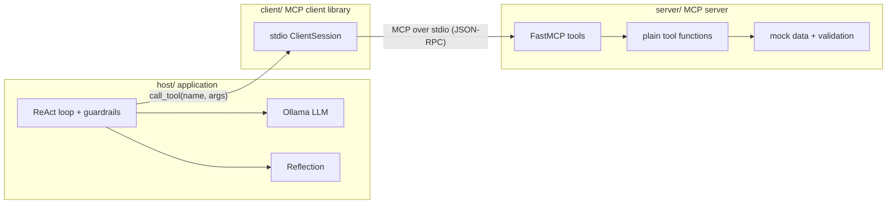

# Architecture

The lab is three separate components that follow the MCP roles. The server exposes tools. The client is the protocol connector. The host owns the model and the ReAct loop, and it uses the client to reach the server.

The client launches the server as a subprocess and speaks MCP over stdio. The host never starts the server itself. Tool names and JSON schemas discovered with `list_tools` are the only contract between the host and the server.

Reflection is a second call to the same model after the ReAct loop has a draft. The model is the judge: it returns `confirmed` or `revised`, the issues it found, and, when it revises, the reply text. The host then drops any date, number, or id in that reply that is not in the tool observations, and records a mismatch when approve, deny, or escalate contradicts `eligible`. Guardrails still decide approve, deny, or escalate before this call.

`run_demo` keeps that subprocess open for every scenario. Tickets are also written to `logging/flags.json`. A new server process, such as a later `run_one`, loads that file, so the duplicate-flag check still sees tickets from the previous request.

## Dependency rules

An import-boundary test in CI enforces these rules:

- `server/` imports nothing from `client/` or `host/`. It is a standalone program, runnable with `python -m equipment_server`. It does not import the root `config` module.
- `client/` imports the `mcp` SDK and may read the server launch command from the root `config` module. It has no knowledge of equipment business rules.
- `host/` imports `equipment_client` and the root `config` module. It does not import `equipment_server`. It discovers tools at runtime through `list_tools`.

## Packaging

One root `pyproject.toml` installs `equipment_server`, `equipment_client`, and `equipment_host`. Pytest puts `.`, `server/src`, `client/src`, and `host/src` on `pythonpath`, so `client/` and `host/` can `import config` from the repo root without the server package depending on it. CI and Docker install the lab once with `pip install -e ".[dev]"`.
